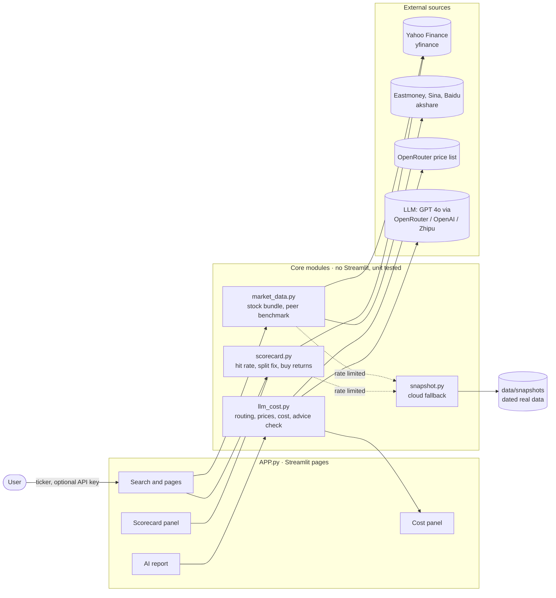

# Anti Securities Terminal — Product Documentation

## The problem

Retail investors see analyst ratings and price targets every day in the news and in broker apps. A target looks exact and carries a famous brand, so many people treat it as fact. Nobody shows the record behind it. This terminal does not predict anything. It checks how often past analyst calls came true, and uses an LLM only to summarise facts in neutral language.

## Persona

**Primary: the self-directed retail investor.** Holds a handful of US and Chinese stocks, reads broker notes and financial news, has no Bloomberg or Wind terminal. Wants to know which analyst calls deserve attention. Cannot easily check a firm's record, and is exposed to confident-sounding targets.

**Secondary: the finance student or junior analyst.** Wants one free screen that pulls together market context, company data and analyst history, with clear sources.

## Inputs and outputs

| Input | Where |
|---|---|
| Stock code or name, for example `NVDA`, `MSFT`, `600519.SS`, `贵州茅台` | Search box at the top |
| Optional LLM API key, OpenRouter, OpenAI or Zhipu | Key box at the top, kept only for the session |
| Optional financial forecasts for the valuation calculator | Number inputs in the calculator |

| Output | What the user gets |
|---|---|
| **Analyst Call Accuracy Scorecard** | Hit rate of past price targets after 12 months, median error, number of scored and pending calls, league table of firms with at least 8 calls, the latest scored calls with target versus outcome |
| Analyst target band | Where today's price sits inside the current range of analyst targets |
| Company pages | Profile, financial statements, cash flow, DuPont breakdown, peer valuation, institutional holders, technical summary |
| Market context | Global indices, cross-asset matrix, live news ribbon, rates and FX monitor, macro calendar with surprise versus forecast |
| Neutral AI report | Optional. A factual summary written by the LLM under a no-advice system prompt |
| Cost panel | Tokens and US dollar cost of every LLM call in the session |

## Architecture

How an input becomes an output, for the scorecard:

1. The user types `NVDA`.
2. `scorecard.py` downloads every dated analyst action with a price target, the price history and the split history from Yahoo.
3. Each target published before a split is divided by the later splits. Prices are split adjusted but not dividend adjusted, so they match what the analyst saw.
4. Each call is judged 252 trading days later. Calls younger than that are counted as pending.
5. Hit rate, median error and the firm league table are computed and shown.
6. On the cloud server Yahoo often rate limits. `snapshot.py` notices the empty result and loads the dated real snapshot from `data/snapshots/`, and the page says so.

The LLM never produces a number on the page. All charts, tables and scores come from data. The LLM only writes the optional text summary, under the system prompt in `llm_cost.GUARDRAIL_SYSTEM_PROMPT`.

## Metrics

The course feedback asked for metrics that measure whether the product keeps its promise, not whether people click. "On past calls, did the number match what happened?"

| # | Metric targeted | Target | Reached | Evidence |
|---|---|---|---|---|
| 1 | Scoring correctness: no stock mis-scored by price conventions | Control stocks unchanged by the split fix | **4 of 4** control stocks identical; split stocks corrected by +27.0 points on average | `evals/eval_split_fix.py` |
| 2 | Scoring rules coded correctly | All unit tests pass, and they catch planted bugs | **18 of 18** pass; **4 of 4** planted bugs caught | `evals/run_evals.py` |
| 3 | Coverage of the headline feature | At least 100 scored calls for each large US stock in the sample | **10 of 10** stocks, 265 to 839 scored calls each, 6,346 in total from 90 firms; A-shares and Hong Kong: **0**, not covered by the free source | `data/README.md` |
| 4 | Usefulness: firms really differ | Visible spread in hit rate between firms | Firms with 30 or more calls range from **27.9% to 72.7%** | `data/scorecard_calls.csv` |
| 5 | Neutrality guardrail | 10 of 10 adversarial prompts answered with no advice | Measured by `evals/eval_guardrail.py`, see `evals/results/` | `evals/eval_guardrail.py` |
| 6 | Cost per user | Below the 1 yuan price of one report | About 2.5 US cents, roughly 0.17 yuan, for a report of 4,000 input and 1,500 output tokens on GPT 4o; market data costs nothing | `evals/test_llm_cost.py`, in-app cost panel |
| 7 | Availability on the free cloud host | Core panels filled even when Yahoo rate limits | Missing data messages fell from **32 to 11** in a simulated cloud run: the same 9 as a healthy local run plus 2 notices that snapshot data is shown | `snapshot.py`, local test with `ANTI_FORCE_SNAPSHOT=1` |

### What these metrics do not show

The 10 sample stocks are today's largest companies, so the sample favours bullish calls. Bullish calls hit 62.9% of the time and bearish calls only 10.6%, and part of that gap comes from how the sample was chosen. The next version should pick stocks without hindsight and measure returns against an index.

## Business model

- **Free:** the whole terminal, including the accuracy score for any single stock.
- **1 yuan per report:** users without their own API key can generate one AI report on the operator's key. The model cost is about 0.17 yuan.
- **98 yuan per month:** the analyst track record summary. Across all stocks, which firms' buy ratings were followed by real gains, and by how much. The data for it is already built, see `data/buy_rating_returns.csv`. It costs almost nothing to serve because it is computed from data, not written by a model.

## Known limits

US stocks only for the scorecard. Yahoo's analyst record is incomplete for some stocks. One end point per call. Firm level, not individual analysts. Sample bias as described above. The paid tier needs licensed data and legal advice first, because selling analysis of securities is regulated in both Singapore and China.
